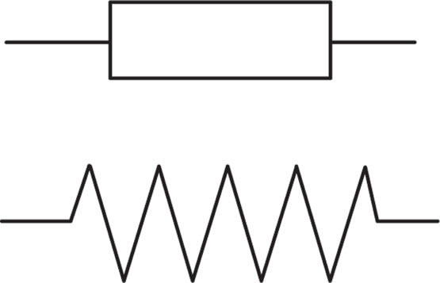
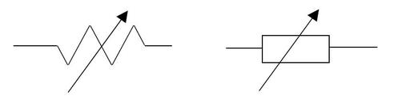
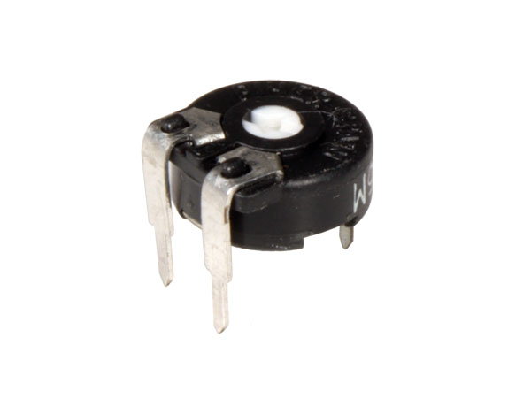

# Electroníca Analógica
### Resistencias fijas.

-¿Para qué sirve?

Limitar la corriente en circuitos eléctricos y dividir voltajes.

-Funcionamiento interno.

Material resistivo que opone una resistencia fija al paso de corriente.

-Símbolo eléctrico.

-Imagen real.

-Algunas aplicaciones de uso.

LEDs, divisores de tensión, filtros.

-Variedades.

De carbón, metálicas, bobinadas, SMD.

### Resistencias variables

**potenciómetros**

-¿Para qué sirve?

Sirve para ajustar y variar manualmente la resistencia para controlar voltajes o señales.

-Funcionamiento interno.

Cursor móvil que varía el contacto sobre una pista resistiva.

-Símbolo eléctrico.

-Imagen real.

-Algunas aplicaciones de uso.

Controles de volumen, brillo, ajustes en circuitos.

-Variedades.

Lineales, logarítmicos, multivueltas.

**NTC**

-¿Para qué sirve?

Medir temperatura; su resistencia disminuye al aumentar la temperatura.

-Funcionamiento interno.

Óxidos metálicos con resistencia negativa según la temperatura.

-Símbolo eléctrico.

-Imagen real.

-Algunas aplicaciones de uso.

Sensores térmicos, protección contra sobrecalentamiento.

-Variedades.

Encapsuladas en disco, perla, SMD.

**PTC**

-¿Para qué sirve?

Protección contra sobrecorriente; su resistencia aumenta con la temperatura.

-Funcionamiento interno.

Material que incrementa su resistencia al elevarse la temperatura.

-Símbolo eléctrico.

-Imagen real.

-Algunas aplicaciones de uso.

Fusibles resetables, protectores térmicos.

-Variedades.

De disco, cilíndricas, SMD.

**LDR**

-¿Para qué sirve?

Detectar intensidad luminosa; su resistencia disminuye con la luz.

-Funcionamiento interno.

Material semiconductor sensible a la luz que varía la resistencia.

-Símbolo eléctrico.

-Imagen real.

-Algunas aplicaciones de uso.
Sensores de luz, sistemas automáticos de iluminación.

-Variedades.

De diferentes tamaños y encapsulados.

**Condensadores.**

-¿Para qué sirve?

Almacenar energía eléctrica y filtrar o acoplar señales.

-Funcionamiento interno.

Dos placas conductoras separadas por un dieléctrico que almacenan carga.

-Símbolo eléctrico.

-Imagen real.

-Algunas aplicaciones de uso.

Fuentes, filtros, temporizadores, acoplamientos.

-Variedades.

Cerámicos, electrolíticos, de poliéster, tantalio.

### Diodos.

-¿Para qué sirve?

Permitir el flujo de corriente en un solo sentido.

-Funcionamiento interno.

Unión P-N que crea una barrera para la corriente en una sola dirección.

-Símbolo eléctrico.

-Imagen real.

-Algunas aplicaciones de uso.
Rectificadores, protección, regulación.

-Variedades.

Rectificadores, Zener, Schottky, LED.

### LED.

-¿Para qué sirve?

Emitir luz al paso de corriente.

-Funcionamiento interno.

Diodo semiconductor que emite fotones al polarizarse.

-Símbolo eléctrico.

-Imagen real.

-Algunas aplicaciones de uso.

Indicadores, iluminación, pantallas.

-Variedades.

RGB, alta potencia, difusos.

### Transistores.

-¿Para qué sirve?

Amplificar señales y funcionar como interruptores.

-Funcionamiento interno.

Capas semiconductoras que controlan grandes corrientes con señales pequeñas.

-Símbolo eléctrico.

-Imagen real.

-Algunas aplicaciones de uso.

Amplificadores, conmutación, circuitos lógicos.

-Variedades.

BJT, MOSFET, JFET.

### Relés.

-¿Para qué sirve?

Controlar circuitos de potencia con señales de baja potencia.

-Funcionamiento interno.

Electroimán que mueve contactos para abrir o cerrar un circuito.

-Símbolo eléctrico.

-Imagen real.

-Algunas aplicaciones de uso.

Automatización, domótica, protección, control de motores.

-Variedades.
Electromecánicos, estado sólido, miniatura, potencia.

