# Electrónica digital

## Puertas lógicas

### NOT(no)

-Símbolo:

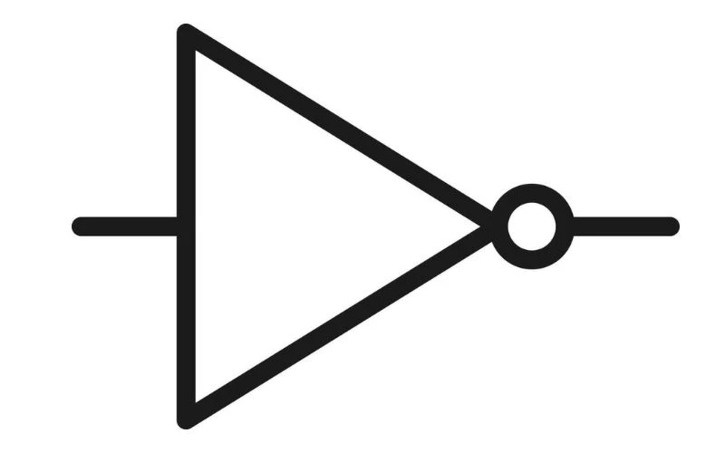

-Función:

La puerta lógica NOT es un componente que invierte la señal de entrada:

-Si la entrada es 1, la salida será 0.

-Si la entrada es 0, la salida será 1.

En resumen: la NOT hace lo contrario de lo que recibe.

-Tabla de verdad:

| a | S |
| --- | --- |
| 0 | 1 |
| 1 | 0 |

-Distribuición interna1

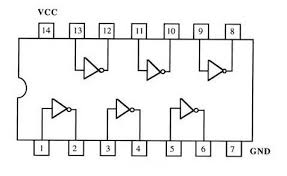

-Donde se pueden encontrar:

Circuitos de control donde una señal activa debe convertirse en una señal desactivada y viceversa (por ejemplo, luces que se encienden cuando un sensor está “en reposo”).

### AND(y)

-Símbolo

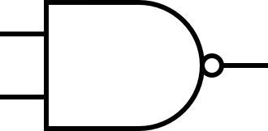

-Función

La puerta lógica AND solo da un 1 en la salida cuando todas sus entradas son 1.

1 AND 1 → 1

1 AND 0 → 0

0 AND 1 → 0

0 AND 0 → 0

En resumen: la AND solo “enciende” si todo lo que recibe está encendido.

-Tabla de verdad

| a | b | S |
| --- | --- | --- |
| 0 | 0 | 0 |
| 0 | 1 | 0 |
| 1 | 0 | 0 |
| 1 | 1 | 1 |

-Distribuición interna2

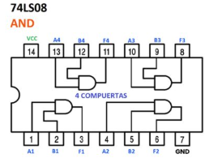

-Donde se pueden encontrar

Sistemas de seguridad donde deben cumplirse varias condiciones a la vez (por ejemplo, puerta cerrada Y contraseña correcta).

Circuitos de control industrial donde dos o más sensores deben estar activos para permitir el funcionamiento de una máquina.

### OR(o)

-Símbolo

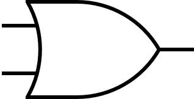

-Función

La puerta lógica OR da un 1 en la salida cuando al menos una de sus entradas es 1.

0 OR 0 → 0

1 OR 0 → 1

0 OR 1 → 1

1 OR 1 → 1

En resumen: la OR “enciende” si alguna de sus entradas está encendida.

-Tabla de verdad

| a | b | S |
| --- | --- | --- |
| 0 | 0 | 0 |
| 0 | 1 | 1 |
| 1 | 0 | 1 |
| 1 | 1 | 1 |

-Distribuición interna3

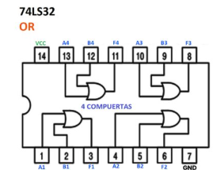

-Donde se pueden encontrar

Sistemas de alarma donde basta con que se active un sensor (puerta, ventana, movimiento) para disparar la señal.

Circuitos de control donde varias entradas alternativas pueden activar una misma función (por ejemplo, dos botones distintos que encienden la misma luz).

### XOR(o exclusiva)

-Símbolo

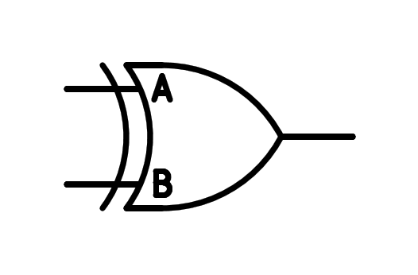

-Función

La puerta lógica XOR da un 1 en la salida solo cuando las entradas son diferentes.
0 XOR 0 → 0

1 XOR 1 → 0

1 XOR 0 → 1

0 XOR 1 → 1

En resumen: la XOR “enciende” si exactamente una de las entradas está encendida, pero no las dos a la vez.

-Tabla de verdad

| a | b | S |
| --- | --- | --- |
| 0 | 0 | 0 |
| 0 | 1 | 1 |
| 1 | 0 | 1 |
| 1 | 1 | 0 |

-Distribuición interna4

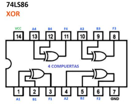

-Donde se pueden encontrar

Comparadores simples para detectar si dos señales son distintas (por ejemplo, detección de errores).

### NOR(o negada)

-Símbolo

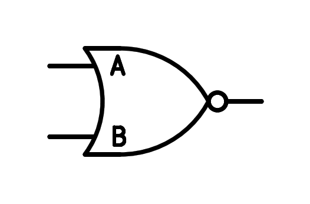

-Función

La puerta lógica NOR es una OR seguida de una NOT.

La salida solo es 1 cuando todas las entradas son 0.

Si al menos una entrada es 1, la salida será 0.

En resumen: la NOR solo “enciende” cuando todo lo que recibe está apagado.

-Tabla de verdad

| a | b | S |
| --- | --- | --- |
| 0 | 0 | 1 |
| 0 | 1 | 0 |
| 1 | 0 | 0 |
| 1 | 1 | 0 |

-Distribuición interna5

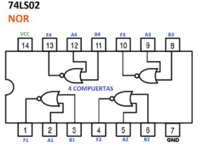

-Donde se pueden encontrar

Circuitos de memoria y registros básicos, donde la NOR se usa como bloque fundamental.

Sistemas de control donde se requiere que ninguna condición de entrada esté activa para habilitar una salida.

### NAND(y negada)

-Símbolo

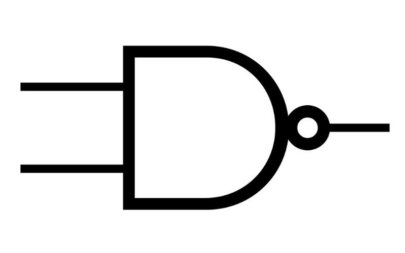

-Función

La puerta lógica NAND es una AND seguida de una NOT.

La salida es 0 solo cuando todas las entradas son 1.

En cualquier otra combinación de entradas, la salida será 1.

En resumen: la NAND está “apagada” solo cuando todo lo que recibe está encendido.

-Tabla de verdad

| a | b | S |
| --- | --- | --- |
| 0 | 0 | 1 |
| 0 | 1 | 1 |
| 1 | 0 | 1 |
| 1 | 1 | 0 |

-Distribuición interna6

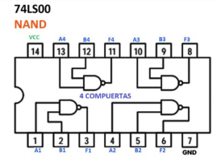

-Donde se pueden encontrar

Construcción de casi cualquier circuito lógico, ya que la NAND es una puerta “universal”.

Implementación interna de memorias, microcontroladores y otros circuitos integrados donde se optimiza el uso de transistores.

## Proyectos puertas logicas

