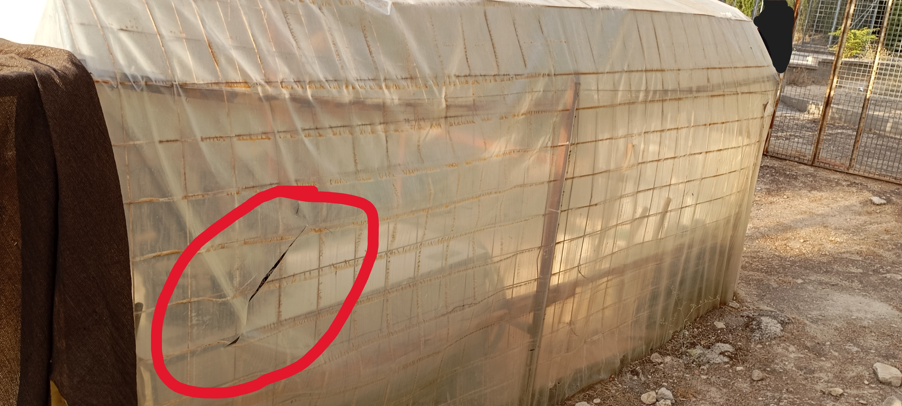
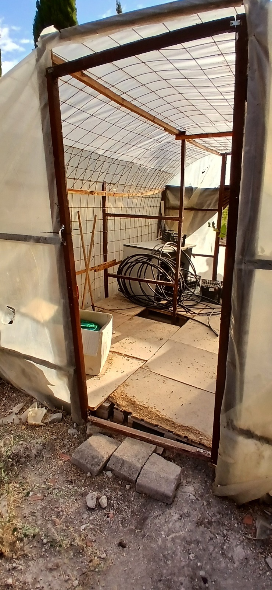
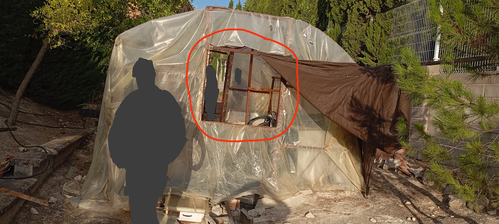
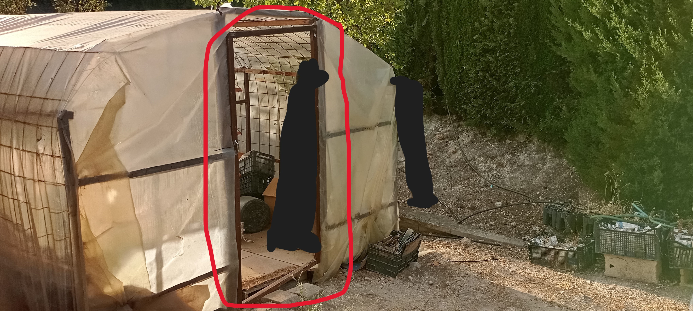

# Tecnología.25-26.4eso
cuaderno tecnología 4 eso - Luis Saavedra

## Proyecto invernadero:

Como podemos ver en las siguientes imagenes, uno de los problenas del invernadero es que esta bastante **deteriorado** por el **tiempo y falta de mantenimiento**.

## Solucines invernadero:

### Problema 1: Vigas de madera dobladas
Uno de los problemas mas importantes de la estructura del inverndero es la siguiente viga de madera remarcada en rojo, esta undida por culpa del peso del agrofilm(el plastico que recubre el invernadero) y las verjas que lo sostienen.

Solución: La solucíon seria añadir 2 vigas de madera como marca el color verde en la imagen de arriba en ambos lados.

### Problema 2: Verja de alambres
El segundo problema del invernadero son las verjas que sotiene el agroflim, ya que esta muy descuidado y tiene muchos alembres salidos de su sitio que rajan el agroflim.

Solución: retirar la verja y cambiara por completo seria muy costoso, asi que retriraremos agroflim y reglaremos los alambres salidos, cortando los excesos de alambre y tapando los extremos con algun tipo de plastilina, el objetivo es eliminar las puntas afiladas que puedan romper el agroflim.

### Problema 3: Agroflim roto.

### Problema 4: Suelo roto.

### Problema 5: Ventana y Puerta:

Ventana:

Puerta:

