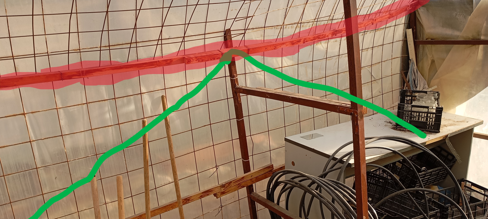

# Tecnología.25-26.4eso
cuaderno tecnología 4 eso - Luis Saavedra

## Proyecto invernadero:

Como podemos ver en las siguientes imagenes, uno de los problenas del invernadero es que esta bastante **deteriorado** por el **tiempo** y **falta de mantenimiento**.

## Solucines invernadero:

Uno de los problemas mas importantes de la estructura del inverndero es la siguiente viga de madera remarcada en rojo 

