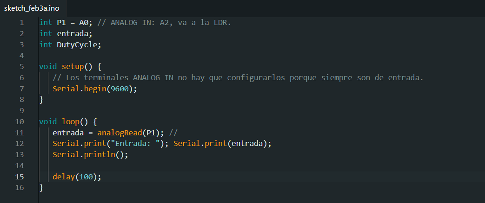

### Sensor de humedad
Explicación:

Video:

Codigo:

### Sensor de presión

Explicación:
El sensor de presion tiene una menbrana que combierte la fuerza en una señal electrica que podemos mapear pasaber la fuerza con la que se le esta presionando. Puede servir por ejemplo para detectar si hay alguien sentado en el asiento de un coche
Video:
[](https://www.youtube.com/watch?v=nafKf1urKBM)

Codigo:


### Sensor de sonido

### Sensor de gas

### LDR(sensor de luz)

### Sensor PIR(Sensor Infrarojo)


Codigo:

```
int LED6 = 6; // el pin 6
int PIR = 7; // el pin 7, por donde entra los datos de el sensor PIR
int lecturaPIR; // variable donde se guardan los datos de la lectura del PIR


void setup() { // se encarga de la configuracion inicial, se ejecuta solo una vez al inicio
Serial.begin (9600); // velocidad de descarga de información baudios
pinMode (LED6, OUTPUT); // pin 6 de salida
pinMode (PIR, INPUT); // pin 7 de entrada
}


void loop() { // hace que lo que se halle dentro se ejecuta infinitamente mientras la placa este encendida


lecturaPIR=digitalRead(PIR); // se hace una lectura del PIR y se le da el valor a la variable 'lecturaPIR'; HIGH(detectado) y LOW(no detectado)


if(lecturaPIR==HIGH){ // "si la lectura de PIR = HIGH(detectado) entonces..."
digitalWrite(LED6, HIGH); // da corriente al pin 6 para encender el led
Serial.println("Movimiento detectado"); // mostrar en el monitor serie "movimiento detectado"
}
if(lecturaPIR==LOW){ // "si la lectura de PIR = LOW(no detectado) entonces..."
digitalWrite(LED6, LOW); // le quita la corriente al pin 6 para apagsr el led
Serial.println("Movimiento no detectado"); // mostrar en el monitor serie "movimiento no detectado"
}
delay(100); // esperar 0.1 segundos antes de repetir el void loop
}


´´´
