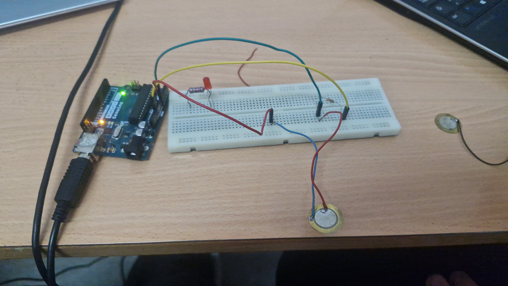
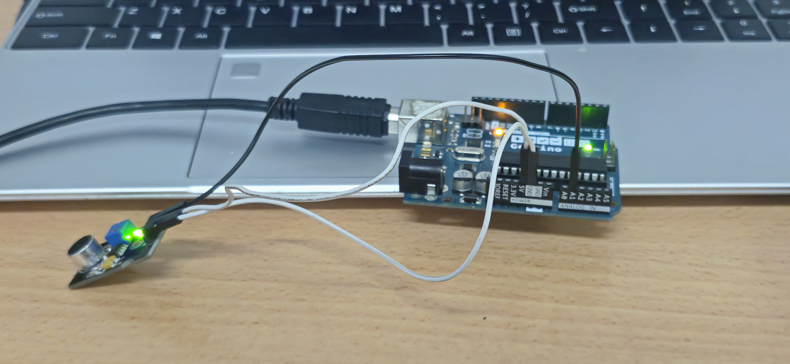
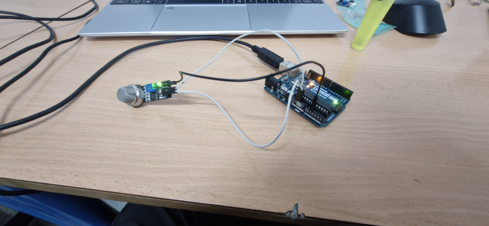

### Sensor de humedad
Explicación:

Un sensor de humedad tiene un material sensible (por ejemplo, un polímero) que cambia sus propiedades eléctricas cuando hay más o menos agua en el aire.

Ese cambio se convierte en una señal eléctrica que podemos leer para saber cuánta humedad hay. Funciona, por ejemplo, para activar un deshumidificador cuando una habitación está demasiado húmeda, o para medir la humedad de la tierra en una maceta y saber si hay que regar.


Video:

[](https://www.youtube.com/watch?v=yI6TIqMYskk)

Codigo:


### Sensor de presión

Explicación:
El sensor de presion tiene una menbrana que combierte la fuerza en una señal electrica que podemos mapear pasaber la fuerza con la que se le esta presionando. Puede servir por ejemplo para detectar si hay alguien sentado en el asiento de un coche.

Imagen:



Video:

[](https://www.youtube.com/watch?v=nafKf1urKBM)

Codigo:


### Sensor de sonido

Explicación:

Un sensor de sonido tiene una pequeña membrana, como la de un micrófono, que vibra cuando le llegan las ondas sonoras.

Esas vibraciones se convierten en una señal eléctrica que podemos medir para saber si hay sonido y qué tan fuerte es. Puede servir, por ejemplo, para que una luz se encienda cuando aplaudes o para medir el ruido en una habitación.

Imagen:



Video:

[](https://www.youtube.com/watch?v=E7mlcuRCIkQ)

Codigo:


### Sensor de gas

Explicación:

Un sensor de gas tiene un material sensible que cambia cuando determinadas moléculas de gas entran en contacto con él (por ejemplo, cambia su resistencia o genera una pequeña corriente eléctrica).

Ese cambio se convierte en una señal eléctrica que podemos medir para saber si hay gas y, a veces, cuánto hay. Puede servir, por ejemplo, para detectar fugas de gas en una cocina y activar una alarma o cortar el suministro antes de que haya una explosión.

Imagen:



Video:

Codigo:


### LDR(sensor de luz)

Explicación:

Un LDR es una resistencia especial cuya resistencia cambia según la luz que le da.

Cuando hay mucha luz su resistencia baja, y cuando hay poca luz su resistencia sube. Esa variación se convierte en una señal eléctrica que podemos usar para saber cuánta luz hay, por ejemplo para encender automáticamente una farola cuando se hace de noche o bajar la intensidad de una luz cuando entra sol por la ventana.

Video:

[](https://www.youtube.com/watch?v=Ui3pkOT5Y)

Codigo:


### Sensor PIR(Sensor Infrarojo)

Explicación:

Un sensor PIR detecta movimiento “viendo” cambios en el calor (radiación infrarroja) de lo que tiene delante.

Tiene un material sensible al infrarrojo que genera una pequeña señal eléctrica cuando pasa delante algo más caliente que el fondo, como una persona. Esa señal se usa para activar o desactivar cosas, por ejemplo encender una luz cuando alguien entra en una habitación o disparar una alarma si detecta a un intruso.

Video:

[](https://www.youtube.com/watch?v=dypxWQvsMdU)

Codigo:

```
int LED6 = 6; // el pin 6
int PIR = 7; // el pin 7, por donde entra los datos de el sensor PIR
int lecturaPIR; // variable donde se guardan los datos de la lectura del PIR


void setup() { // se encarga de la configuracion inicial, se ejecuta solo una vez al inicio
Serial.begin (9600); // velocidad de descarga de información baudios
pinMode (LED6, OUTPUT); // pin 6 de salida
pinMode (PIR, INPUT); // pin 7 de entrada
}


void loop() { // hace que lo que se halle dentro se ejecuta infinitamente mientras la placa este encendida


lecturaPIR=digitalRead(PIR); // se hace una lectura del PIR y se le da el valor a la variable 'lecturaPIR'; HIGH(detectado) y LOW(no detectado)


if(lecturaPIR==HIGH){ // "si la lectura de PIR = HIGH(detectado) entonces..."
digitalWrite(LED6, HIGH); // da corriente al pin 6 para encender el led
Serial.println("Movimiento detectado"); // mostrar en el monitor serie "movimiento detectado"
}
if(lecturaPIR==LOW){ // "si la lectura de PIR = LOW(no detectado) entonces..."
digitalWrite(LED6, LOW); // le quita la corriente al pin 6 para apagsr el led
Serial.println("Movimiento no detectado"); // mostrar en el monitor serie "movimiento no detectado"
}
delay(100); // esperar 0.1 segundos antes de repetir el void loop
}


´´´
